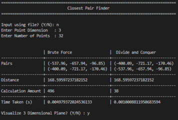
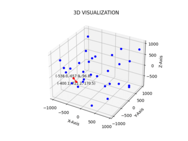
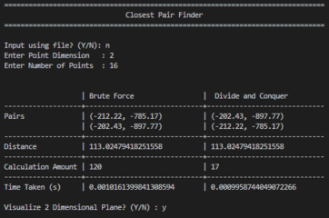
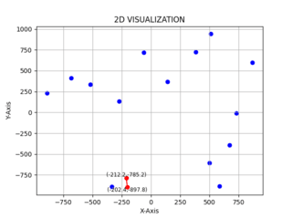

# Tucil2_13521081_13521114 - Closest Pair Finder
Find Closest Pair of Points in Multidimensional Plane
> IF2211 Algorithm Strategies 2022/2023 Mini Project 2

## Description
This program uses both `Divide and Conquer` and `Brute Force` algorithms to provide two different approaches for finding the closest pair of points in a multidimensional plane.

The input parameters of the program consist of `d`, which represent the size of the plane's dimension and `n`, which represents the number of points. The program will then generate `n` randomly located points in a `d`-dimensional plane.

Then the program will search for the closest pair of points using the `Brute Force` and `Divide and Conquer` algorithms, and compare their performance.

The program can also perform visualization for 2D and 3D planes.

## Screenshots
 
<p align="center">
  3D Closest Pair and Visualization
</p>

 
<p align="center">
  2D Closest Pair and Visualization
</p>

## How To Run
To run the program, you can either
1. Double click on the executable file `main.exe` in `bin/` folder, or
2. Run `python src/main.py` script in command prompt
   ```
   python src/main.py
   ```
note that you need to have `Python` and `Matplotlib` installed to run the script

## Authors
- Bagas Aryo Seto - 13521081 [@bagas003](https://github.com/bagas003)
- Farhan Nabil Suryono - 13521114 [@Altair1618](https://github.com/Altair1618)
